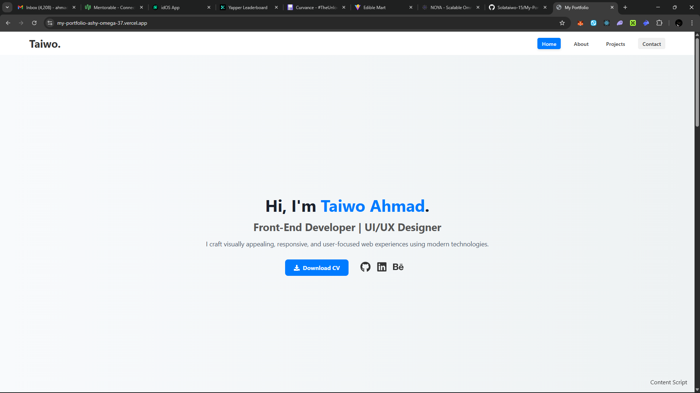

# My Personal Portfolio Website

This repository contains the source code for my personal portfolio, a modern and responsive single-page application built with React. The goal of this project is to showcase my skills, feature my best work, and provide a seamless user experience for visitors.

### ✨ [View the Live Site Here!](https://my-portfolio-ashy-omega-37.vercel.app/)

---

## 🚀 About The Project

I originally built this portfolio as a multi-page website. To modernize the user experience and create a more fluid narrative, I refactored it into a single-page application. This version guides visitors through a clean, linear story of my skills and projects, all without ever needing to refresh the page.

The design is clean, fully responsive, and features subtle animations to make the experience more engaging.

## 🌟 Key Features

- **Single-Page Layout:** All content is accessible on one page for a fast and uninterrupted experience.
- **Smooth Scrolling:** Navigation links smoothly animate the scroll to the corresponding section.
- **Responsive Design:** The layout is optimized for all screen sizes, from mobile phones to desktop monitors.
- **Interactive Project Showcase:** A clean grid layout displays my projects with links to live demos.
- **Animations on Scroll:** Elements subtly fade in as they enter the viewport, powered by the AOS library.
- **Functional Contact Form:** An integrated EmailJS form allows visitors to send messages directly to my inbox.

## 🛠️ Built With

This portfolio was built using a modern front-end tech stack:

- **Framework:** [React.js](https://reactjs.org/)
- **Styling:** Plain CSS with a focus on Flexbox and Grid for responsive layouts.
- **Animations:** [AOS (Animate On Scroll)](https://michalsnik.github.io/aos/)
- **Icons:** [React Icons](https://react-icons.github.io/react-icons/)
- **Smooth Scrolling:** [React Scroll](https://github.com/fisshy/react-scroll)
- **Contact Form:** [EmailJS](https://www.emailjs.com/)

## 📫 Contact

**Ahmad Taiwo**

- **[LinkedIn](https://www.linkedin.com/in/ahmad-taiwo/)**
- **[GitHub](https://github.com/Solataiwo-15)**
- **[Behamce](https://www.behance.net/ahmadtaiwo15)**
